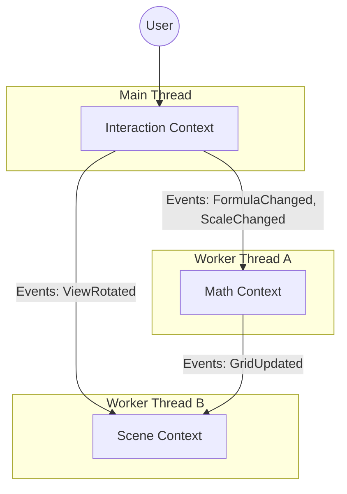

# Context Map

## Overview
The system is composed of three distinct Bounded Contexts that communicate asynchronously via Domain Events.

## Relationships

| Upstream Context | Downstream Context | Relationship | description |
| :--- | :--- | :--- | :--- |
| **Interaction** | **Math** | Customer/Supplier | `Interaction` supplies the *Formula* and *Scale* requirements; `Math` performs the calculation. |
| **Interaction** | **Scene** | Customer/Supplier | `Interaction` supplies *Camera Controls* (rotation intent); `Scene` renders it. |
| **Math** | **Scene** | Open Host Service / ACL | `Math` publishes `GridUpdated` events containing raw data chunks. `Scene` consumes them to update the visual Mesh. |

## Communication Protocols
- **Transport**: `postMessage` (Web Worker API)
- **Serialization**: 
    - Standard JSON for Control Events (e.g., Formula strings).
    - **Transferable Objects** (`ArrayBuffer`) for Data Events (e.g., Coordinate Grids) to ensure zero-copy performance.
